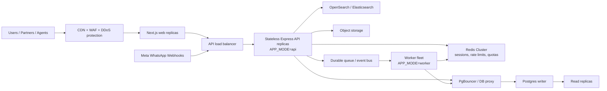

# NexaFlow AI 10M-User Scale Architecture

Target: design the platform so it can grow toward 10M+ registered users and very high concurrent traffic through horizontal scaling. A single laptop or single Node.js process cannot handle 10M users at once; the code must run as many stateless API replicas, separate worker fleets, managed databases, queues, and caches.

## Architecture Shape

## Code Changes Already Applied

- API process mode is now configurable:
  - `APP_MODE=api`: HTTP server only, safe to horizontally scale.
  - `APP_MODE=worker`: background workers only.
  - `APP_MODE=all`: local development mode.
- Background workers no longer have to run inside every API replica.
- Redis-backed rate limiting replaces per-process memory limiting.
- `/live` and `/ready` endpoints exist for load balancer and Kubernetes health checks.
- Graceful shutdown closes HTTP, workers, Prisma, and Redis.

## Production Runtime Modes

Use these as separate deployments:

| Deployment | Command/env | Scaling rule |
| --- | --- | --- |
| Web | Next.js app | Scale by CPU/RPS and cache hit ratio |
| API | `APP_MODE=api` | Scale horizontally behind a load balancer |
| Worker | `APP_MODE=worker` | Scale by queue depth and job latency |
| Database | Managed Postgres + PgBouncer | Scale with indexes, read replicas, partitioning, sharding |
| Redis | Redis Cluster / managed Redis | Scale with memory, ops/sec, shard count |
| Search | OpenSearch/Elasticsearch cluster | Scale by index size and query throughput |

## Data Scale Rules

1. Every tenant-owned table must keep `tenantId` indexed.
2. Very large write-heavy tables need time or tenant partitioning:
   - `Message`
   - `WebhookLog`
   - `AuditLog`
   - `AiUsage`
   - future transaction ledger tables
3. Read-heavy dashboards should use aggregate tables or cached summaries, not full-table scans.
4. Analytics should move from OLTP Postgres to warehouse/OpenSearch once volume grows.
5. Use PgBouncer or a managed pooler; do not let hundreds of Node replicas open unlimited DB connections.

## API Scale Rules

1. APIs must stay stateless. No in-memory sessions, rate limits, queues, or locks.
2. All request limits, refresh sessions, quotas, throttles, and locks must live in Redis or the database.
3. Webhook endpoints must acknowledge quickly and enqueue heavy work.
4. Large fan-out jobs such as campaigns must run in workers, not in request handlers.
5. Long-running AI or Meta calls should be queue-backed with retries and idempotency keys.

## Worker Scale Rules

Current workers are in-process pollers. This is acceptable for development and early pilots, but 10M scale needs a durable queue.

Recommended next upgrade:

- BullMQ or a managed queue for campaigns, webhooks, flow resumes, appointments, and AI jobs.
- Job idempotency key per tenant/resource/event.
- Dead-letter queue for failed jobs.
- Queue-depth based autoscaling.

## Capacity Planning Direction

10M registered users does not mean 10M simultaneous HTTP requests. Plan by active concurrency:

| Layer | Initial production target | Scale path |
| --- | --- | --- |
| API | 20-50 replicas | HPA by p95 latency and CPU |
| Web | 10-30 replicas / edge cache | CDN + static caching |
| Workers | 10-100 replicas | queue-depth autoscaling |
| Postgres | managed primary + read replicas | partitioning, shard by tenant tier |
| Redis | managed cluster | keyspace sharding |
| Search | 3+ node OpenSearch | index lifecycle management |

## Remaining Work For True 10M Readiness

- Move campaign/flow/webhook/appointment/follow-up workers to durable queue jobs.
- Add PgBouncer and production connection limits.
- Add database migrations for partitioning high-volume tables.
- Add idempotency keys to webhook processing and outbound sends.
- Add OpenTelemetry traces, Sentry errors, and APM dashboards.
- Add load tests with k6:
  - login/read dashboard
  - WhatsApp webhook burst
  - inbox message list
  - campaign fan-out enqueue
- Add CI/CD deployment manifests and environment-specific secrets.

## Non-Negotiables

- Do not claim 10M capacity without load tests on real infrastructure.
- Do not run workers inside every API replica in production.
- Do not use in-memory state for rate limits, jobs, sessions, or quotas.
- Do not execute campaign fan-out directly inside API request latency.
